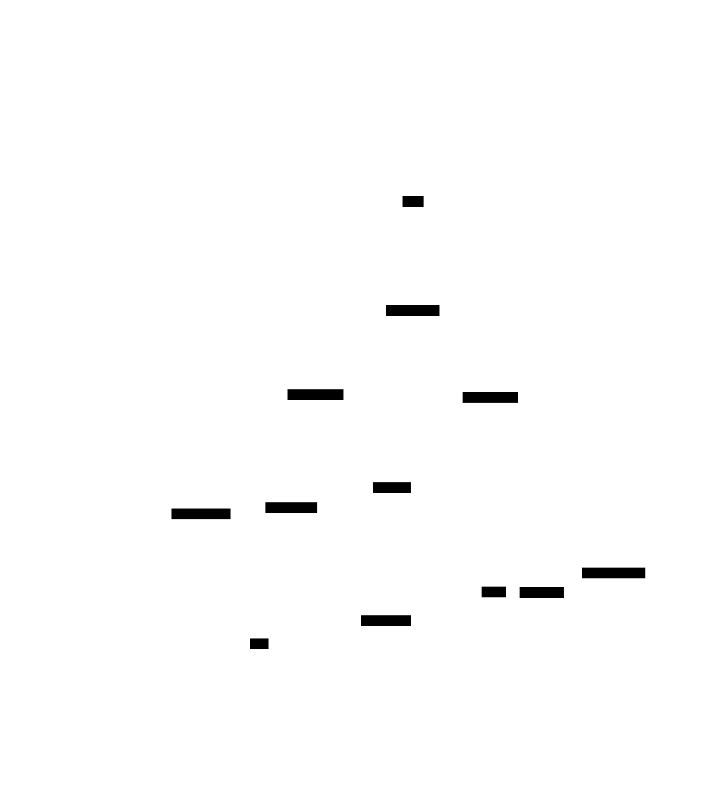

# Smart Doorbell – Face Recognition IoT System

An event-driven smart doorbell built with a Raspberry Pi 4, camera module, and a mobile app. When someone presses the button, the system captures an image, runs face recognition locally, and sends a push notification to your phone.

# To start project on pi:
Clone on pi:
```
git clone https://github.com/Matsjohaa/smart_doorbell
```
To start project:
```
cd ~/smart_doorbell
git pull
python3 -m venv --system-site-packages venv
source venv/bin/activate
pip install -r requirements.txt
cd pi
python3 main.py
```


# To start mobile app:

```
cd app
npm install
npx expo start
```

Scan the QR code with Expo Go on your phone. Make sure your phone is on the same Wi-Fi as the Pi.


## Project Flow




## Project Structure

```
smart_doorbell/
├── pi/                      # Raspberry Pi backend
│   ├── main.py              # Entry point – starts all subsystems
│   ├── config.py            # Configuration constants & paths
│   ├── database.py          # SQLite helpers (people + events)
│   ├── gpio_handler.py      # Button press detection via GPIO
│   ├── camera.py            # Still capture & MJPEG streaming
│   ├── recognizer.py        # Face detection & recognition
│   ├── notifier.py          # Push notifications (Expo Push Service)
│   ├── api.py               # Flask REST API for the mobile app
│   └── data/                # Created at runtime
│       ├── doorbell.db      # SQLite database
│       ├── captures/        # Saved event snapshots
│       └── known_faces/     # Reference images for known people
├── app/                     # Mobile app (React Native / Flutter – TBD)
├── requirements.txt
└── README.md
```

## Hardware Required

| Component | Details |
|-----------|---------|
| Raspberry Pi 4 | With microSD card and power supply |
| Camera Module 2 | 8 MP, 1080p video, 3280×2464 stills |
| Tactile button | Connected to GPIO 17 (BCM) via breadboard |
| Jumper wires (M/F) | For button → GPIO connection |
| Breadboard | For wiring the button |

### Wiring

Connect the button between **GPIO 17** and **3.3V** with a pull-down resistor, or rely on the software pull-down configured in `gpio_handler.py`.

```
GPIO 17  ──── Button ──── 3.3V
              │
             10kΩ
              │
             GND
```


## API Endpoints

The Flask server runs on `http://<pi-ip>:5000`.

| Method | Endpoint | Description |
|--------|----------|-------------|
| GET | `/stream` | MJPEG live camera feed |
| GET | `/events` | List events (`?limit=50&offset=0`) |
| GET | `/events/<id>` | Single event details |
| PATCH | `/events/<id>/seen` | Mark notification as read |
| GET | `/people` | List known people |
| POST | `/people` | Add person (form: `name` + `image` file) |
| DELETE | `/people/<id>` | Remove a known person |
| GET | `/captures/<file>` | Serve a captured image |
| POST | `/trigger` | Simulate button press (for testing) |


## Mobile App

The app connects to the Pi's REST API and provides three screens:

1. **Live View** – Streams the camera feed via MJPEG.
2. **Notifications** – Shows event log with timestamps and recognition results.
3. **People Management** – Add/remove known faces.
